title: 
Software Architecture Model by Tommaso Rodolfo Masera
---
 
# Getting started

You will use [Markdown](https://www.markdownguide.org/cheat-sheetplan) and [PlantUML](https://plantuml.com/) to describe a software architecture model about your own project.

This document will grow during the semester as you sketch and refine your software architecture model.

When you are done with each task, please push so we can give you feedback about your work.

We begin by selecting a suitable project domain.


# Ex - Domain Selection 

{.instructions

Submit the name and brief description (about 100 words) of your domain using the following vision statement template:

```
For [target customers]
Who [need/opportunity/problem]
The [name your project]
Is  [type of project]
That [major features, core benefits, compelling reason to buy]
Unlike [current reality or competitors]
Our Project [summarize main advantages over status quo, unique selling point]
```

Please indicate if your choice is:

* a project you have worked on in the past (by yourself or with a team)
* a project you are going to work on this semester in another lecture (which one?)
* a new project you plan to build in the future
* some existing open source project you are interested to contribute to

The chosen domain should be unique for each student.

Please be ready to give a 2 minute presentation about it (you can use a slide but it's not necessary)

Hint: to choose a meaningful project look at the rest of the modeling tasks which you are going to perform in the context of your domain.

}

Project Name: Internet Marketplace

Project Type: Website/Web Application

Vision Statement:
```
For: Any person who could make an online purchase 
     (most likely young adults and middle-aged people but nobody would be excluded)
     
Who: Require a place to easily find a product to purchase or sell their own

The: Internet Marketplace

Is: Website/Web Application

That: Allows users to find links to access a product directly on the seller's website 
      as well as being able to post about or sell their own products and, if a user is
      selling their own product, allow interested users to contact the seller via an
      integrated direct messaging tool

Unlike: Google shopping or ebay, the idea is to combine the best of both competitors and allow
        for a platform to help users find what they require to purchase both through
        certified sellers that may ship internationally as a company and any user that would like
        to sell something they own
Our Project: Aims to offer an online marketplace where people can find any kind of e-shopping site
             and make the purchase that they truly want without being limited by a catalogue. The
             project would like to offer a user the ability to find what they want by redirecting them to
             specialized sellers.
```

Additional Information: If a website like this already exists, I am currently not aware of it. The project is born as an idea that could be developed in the future.


# Ex - Architectural Decision Records

{.instructions

Software architecture is about making design decisions that will impact the quality of the software you plan to build.

Let's practice how to describe an architectural decision. We will keep using ADRs to document architectural decisions in the rest of the model.

Use the following template to capture one or more architectural design decisions in the context of your project domain

Pass: 1 ADR

Good: 2 ADR

Exceed: >2 ADR

}


## __ADR #1__: Type of Software

### Decision Made

- The software will be built as a website.

### Context of the Decision

 - The context of the decision consists of finding the infrastructure of the software that would make the most sense and would reach as many users as possible.

 - The objective of the choice is to be able to make the software easily accessible by anyone at any time from any device.

- Given the requirements, the choice will fully impact the the architecture of the software as it involves the way it will be implemented from scratch.

### Solved Problem

- How can we provide our service?

###  Alternatives Considered

- Website
- Web Application
- Mobile Application

### Choice Made

- Website

### Reason for the Choice

In order to achieve the purpose of the software, a website would be the more suitable option over a web application or a mobile application because, firstly, a mobile application would not be able to reach people on other non-portable devices while a website and a web application would be accessible via a browser from any device given proper support.

Furthermore, what motivates the choice from website over web application is the fact that a website would fit more the goals of the software. The main purpose of the software is to allow users to find (anonymously or with an account) products and then be redirected towards the seller of that product, the website acts as an easier search tool for online shopping without providing a real service through its main purpose.

An argument could be made that a web application would suit best the ability for transactions to occur between users that generated their own content but, even then, what the website does is to allow them to get in contact and contract on their own.

Therefore, from a practical point of view, a website would be a more intuitive and direct approach than a web application.

## __ADR #2__: Crawling Technology

### Decision Made

- The web crawling framework will be Scrapy.

### Context of the Decision

 - The context and the objective to achieve with this decision is to have a tool that can allow
for web crawling given that the final website will be hosting data crawled directly from sellers' websites.

 - The main requirement of this choice is to get all possible crawled products as up to date as possible so they can be displayed.

- Given that its purpose is to obtain the very data that will be displayed on the website, the scope of the decision will affect a great part of the architecture with the exception of user-created content such as posts as those will not require any crawling.

### Solved Problem

- How can we obtain the core data necessary to the website?

###  Alternatives Considered

| Framework | Language |
|---|---|
|Scrapy| Python |
| BeautifulSoup | Python |
| Cheerio | PHP |
| Kimura | Ruby |
| Goutte | PHP |

### Choice Made

- Scrapy

### Reason for the Choice

Pros:

* Familiarity with the framework
* Simplicity of the programming language that the framework is implemented in
* Scrapy:
  - extracts data in different formats (CSV, JSON, XML)
  - allows for asynchronous crawling of pages
  - does not take up too much memory or CPU
  - can extract large amounts of data
  - is fast and regulates speed for crawlers automatically

Cons:

* Scrapy does not handle JavaScript 
* Works only with versions of Python after 2.7 (included)

## __ADR #3__: Search Technology

### Decision Made

- The search functionality of the website will be Elasticsearch.

### Context of the Decision

 - The context of the decision stems from the fact that we need to provide users with a search functionality that will match what they find on the website as closely as possible to what they are looking for. Moreover, this search takes place over a massive amount of data and is required to be fast and to the point.

 - The main objective of the choice is to query the crawled data as efficiently and effectively as possible in order to provide the user with the best products.

- This decision will likely affect the architecture in its entirety. The search functionality would take into account both crawled and user-generated content leaving no products out of the picture.

### Solved Problem

- How can we provide the users with fast and relevant search results?

###  Alternatives Considered

- Elasticsearch
- Solr
- Sphinx

### Choice Made

- Elasticsearch

### Reason for the Choice

Pros:

* Horizontally scalable
* Schema-less
* Fastest among the options
* Suited for data that updates frequently
* Open-source
* Integrated data visualization with Kibana

Cons:

* Not good for persistent storage
* API can be hard to use and to learn


# Ex - Quality Attribute Scenario

{.instructions

1. Pick a scenario for a specific quality attribute. Describe it with natural language.

2. Refine the scenario using the following structure:

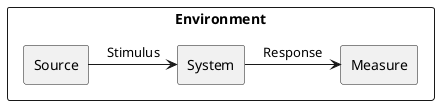

*Stimulus*: condition affecting the system

*Source*: entity generating the stimulus

*Environment*: context under which stimulus occurred (e.g., build, test, deployment, startup, normal operation, overload, failure, attack, change)

*Response*: observable result of the stimulus

*Measure*: benchmark or target value defining a successful response

Pass: 3 scenarios

Good: >3 scenarios

Exceed: >6 scenarios using challenging qualities

}

## Example Scenario

Quality: _Recoverability_

Scenario: In case of power failure, rebooting the system should take up to 20 seconds.

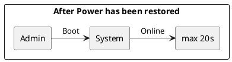

## Scenario 1

Quality: _Freshness_

Scenario: To provide up-to-date information on the website, the data will be crawled at regular intervals between 12h and 48h (to be decided).
 
 ```puml
@startuml

skinparam componentStyle rectangle
skinparam monochrome true
skinparam shadowing false

rectangle "Updating Data" {

rectangle "Automatic Script" as Source
rectangle "Every 12h to 48h" as Measure

Source -> [System] : "Request Update"

[System] -> [Measure] : "Run Crawlers"

}

@enduml
```

## Scenario 2

Quality: _Compatibility_

Scenario: Given that the system will be accessed by users via a web browser, the system should be able to display properly on as many devices and web browsers as possible.

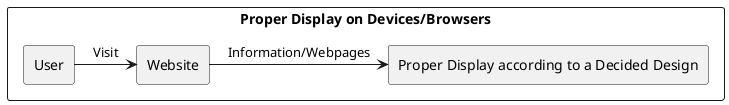

## Scenario 3

Quality: _Scalability_

Scenario: The system should be able to handle an increasing number of users and data without critically hindering performance.

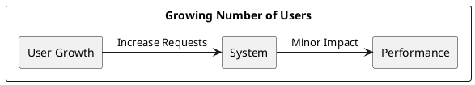

## Scenario 4

Quality: _Simplicity_

Scenario: The user interface should be simple and lightweight to not overwhelm users with too much information at once.

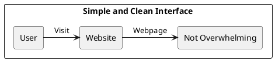

## Scenario 5

Quality: _Learnability_

Scenario: The user interface should resemble familiar and common interfaces to minimize as much as possible the learning curve of the user and allow them to use the website within 2 minutes of their arrival.

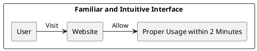

## Scenario 6

Quality: _Privacy_

Scenario: Account creation should be optional and will not require anything other than a username, an email and a password without asking for any sensitive information.

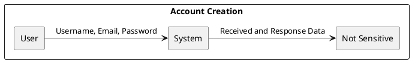

## Scenario 7

Quality: _Feasibility (Affordability)_

Scenario: The system may lack data if crawlers are blocked or if there is no legal permission to crawl a website.

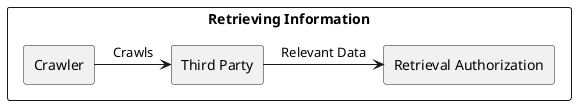


# Ex - Quality Attribute Tradeoff

{.instructions

Pick a free combination of two qualities on the [map](https://usi365.sharepoint.com/:x:/s/MSDE-2022-SoftwareArchitecture/ESVksoXVgMNHtKBKrIwatMYBqorOFaKjxnoqssEy0gNPCg?e=81W7SI) and write your name to claim it.

Then write a short text giving an example for the tradeoff in this assignment.

Pass: 1 unique trade-off

Good: 2 trade-offs

Exceed: >2 trade-offs

}

## Portability vs. Performance (Example)

Developing an app natively for each OS is expensive and time consuming, but it benefits from a good performance. Choosing a cross-platform environment on the other hand simplify the development process, making it faster and cheaper, but it might suffer in performance.

## Availability vs. Feasibility

Crawling any possible website for data would increase the availability of information on the domain but would imply getting blocked or even breaking the law. Crawling only websites that gave permission to do so would allow the domain to exist without any violations but would reduce the available data over the website.

## Privacy vs. Customizability

If the website were to provide a recommender system to users to suggest products to users, it would benefit from asking for data such as age or gender of the user to improve the recommendations but it would imply that we would possibly store sensitive data regarding the user. On the other hand, to the benefit of privacy we could not store any data that to be fed to a recommender system and, therefore, its accuracy may initially suffer.

## Availability as Freshness vs Durability

Bringing fresh data to the users would imply a frequent refresh of the entirety of the data that we store meaning that, while we would use a persisent storage to achieve it, we do not care about keeping old products but only about the most recent and available ones and we would lose long term durability of the data. Storing permanently all the data that we frequently refresh would allow for an immense database but it would not benefit the service whatsoever as we would not use the old data in any way. Additionally, we could argue that keeping so much data could hinder the capacity of the system as the data will grow very quickly.

# Ex - Feature Modeling

{.instructions

In the context of your chosen project domain, describe your domain using a feature model.

The feature model should be correctly visualized using the following template:


If possible, make use of all modeling constructs.

Pass: Include at least 4 non-trivial features

Good: Include at least 6 non-trivial features, which are all implemented by your project

Exceed: Include more than 8 non-trivial features, indicate which are found in your project and which belong to one competitor

}


# Ex - Context Diagram

{.instructions

Prepare a context diagram to define the design boundary for your project.

Here is a PlantUML/C4 example to get started.


Make sure to include all possible user personas and external dependencies you may need.

Pass: 1 User and 1 Dependency

Good: >1 User and >1 Dependency

Exceed: >1 User and >1 Dependency, with both incoming and outgoing dependencies

}


# Ex - Component Model: Top-Down

{.instructions

Within the context of your project domain, represent a model of your modular software architecture decomposed into components.

The number of components in your logical view should be between 6 and 9:

- At least one component should be further decomposed into sub components
- At least one component should already exist. You should plan how to reuse it, by locating it in some software repository and including in your model the exact link to its specification and its price.
- At least one component should be stateful.

The logical view should represent provide/require dependencies that are consistent with the interactions represented in the process view.

The process view should illustrate how the proposed decomposition is used to satisfy the main use case given by your domain model.

You can add additional process views showing how other use cases can be satisfied by the same set of components.

This assignment will focus on modularity-related decisions, we will worry about deployment and the container view later.

Here is a PlantUML example logical view and process view.

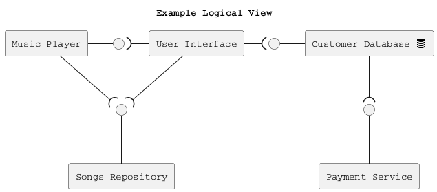

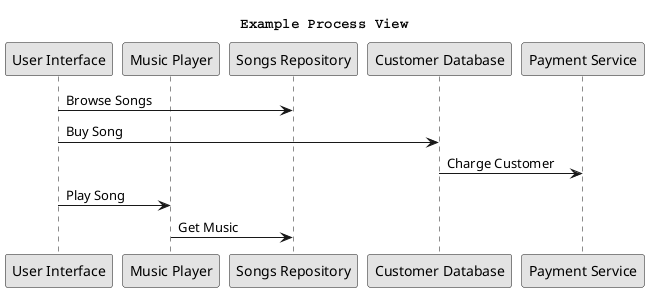

Hint: How to connect sub-components to other external components? Use this pattern.

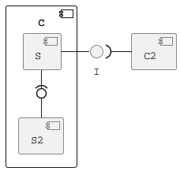

Pass: 6 components (1 decomposed), 1 use case/process view

Good: 6 components (1 decomposed), 2 use case/process view

Exceed: >6 components (>1 decomposed) and >2 use case/process view

}

## Logical View

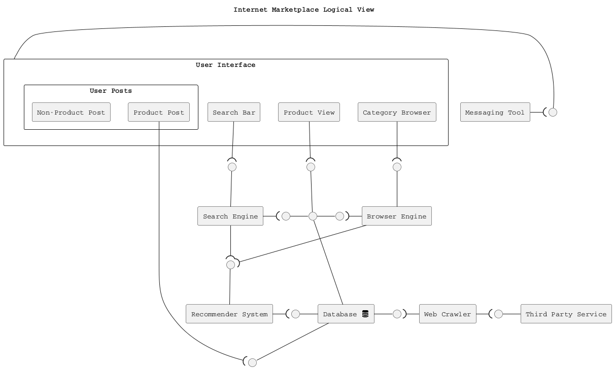

## Process Views

### User Search and Browse

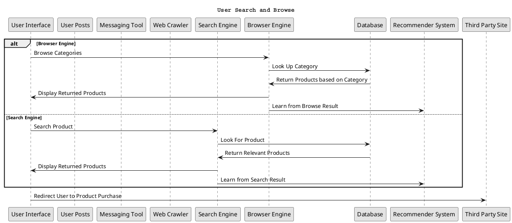

### User Post or Crawled Data

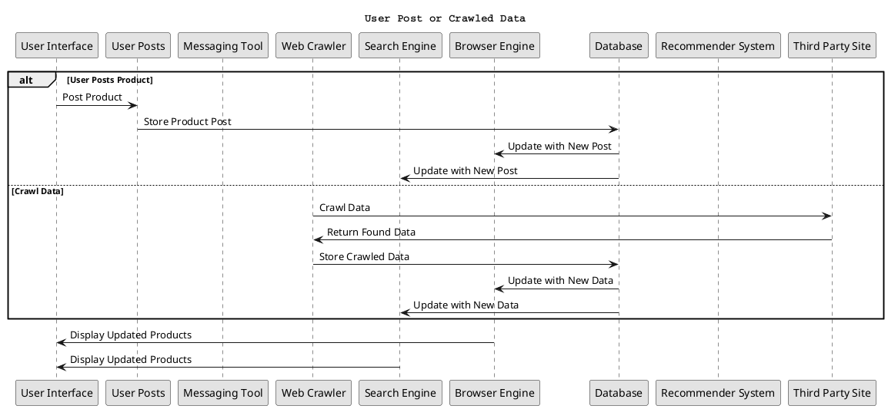

### Contact Other Users

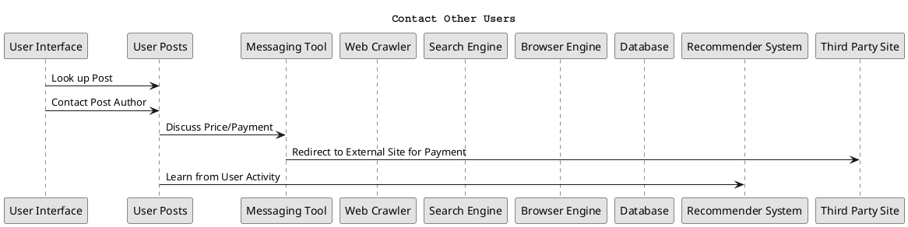


# Ex - Component Model: Bottom-Up

{.instructions

Within the context of your project domain, represent a model of your modular software architecture decomposed into components.

To design this model you should attempt to buy and reuse as many components as possible.

In addition to the logical and process views, you should give a precise list to all sources and prices of the components you have selected to be reused.

Write an ADR to document your component selection process (indicating which alternatives were considered).

Pass: Existing design with at least 1 reused components (1 Logical View, 1 Process View)

Good: Existing design with at least 3 reused components (1 Logical View, 1 Process View, 1 ADR)

Exceed: Redesign based on >3 reused components (1 Logical View, >1 Process View, >1 ADR)

}

## Logical View

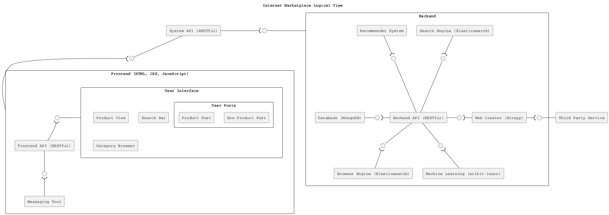

## Process Views

### User Search and Browse

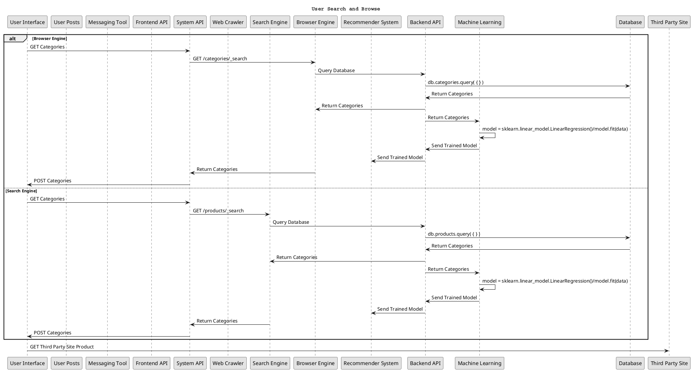

### User Post or Crawled Data

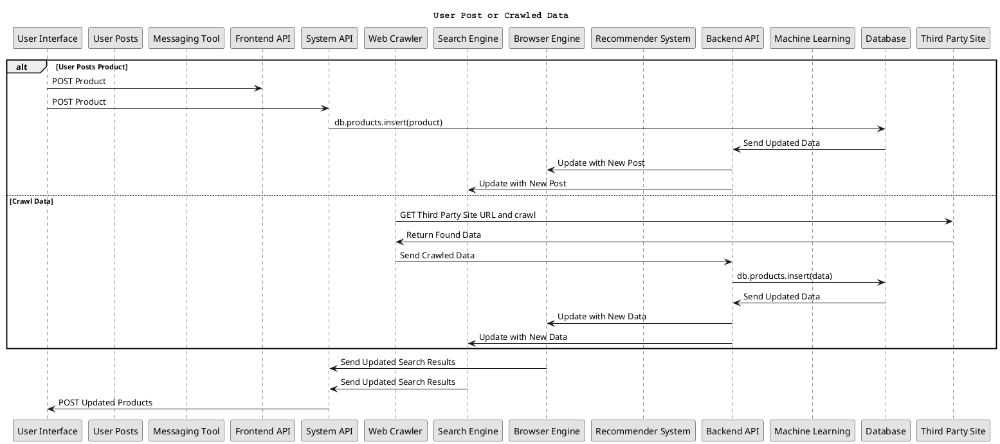

### Contact Other Users

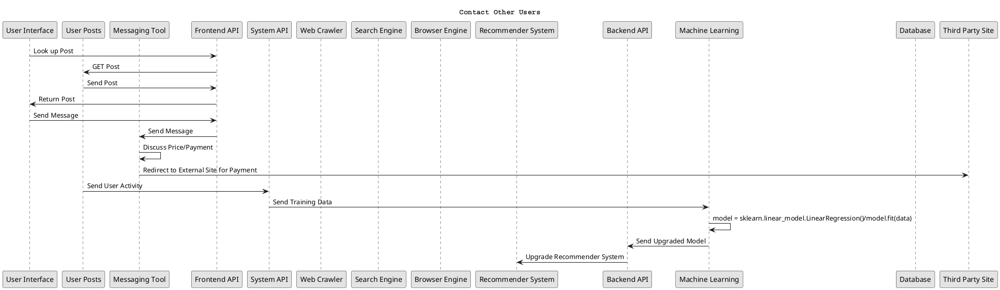

## ADR #1: Crawling Technology

For this architectural decision record, please refer to [the record described here](#adr-2-crawling-technology).

## ADR #2: Training Technology
Decision Made

  - The framework to be used to train the recommender system model will be scikit-learn with pandas and NumPy

Context of the Decision

  - The context of this decision involves training a proper recommender system such that users will find useful suggestions related to them when visiting our website.
  
  - The objective is to allow for the training of a model that will suggest products to users reliably and efficiently

  - This decision will not affect much of the architecture, only a subset of the backend will be impacted by this choice.

Solved Problem

  - How do we provide a reliable recommender system?

Alternatives Considered

  - scikit-learn
  - TensorFlow
  - SciPy

Choice Made

  - scikit-learn

Reason for the Choice

The reason behind the choice is mostly due to personal familiarity with the framework as it has been used and covered in university courses. In addition pandas and NumPy will be used as auxiliary tools to manipulate the data to then be used by the model to train itself.

## ADR #3: Database Technology

Decision Made

- The Database technology will be MongoDB

Context of the Decision

- The context involves storing data that can vary in the information it provides and standardize it to a single format.

- This decision will affect the backend as the database provides information to all the other backend services which will then provide it to the frontend.

Solved Problem

- How can we store the data of products properly?

Alternatives Considered

- MongoDB
- MySQL
- Cassandra
- Neo4j

Choice Made

- MongoDB

Reason for the Choice

The reason behind choosing MongoDB is that, given that products can vary from site to site with possibly missing (or redundant) information and are mostly described in plain text, a documental database would be the best option to store it.

## ADR #4: Search Technology

For this architectural decision record, please refer to [the record described here](#adr-3-search-technology).


# Ex - Interface/API Specification

{.instructions

In this iteration, we will detail your previous model to specify the provided interface of all components based on their interactions found in your existing process views.

1. choose whether to use the top down or bottom up model. If you specify the interfaces of the bottom up model, your interface descriptions should match what the components you reuse already offer.

2. decide which interface elements are operations, properties, or events.

Get started with one of these PlantUML templates, or you can come up with your own notation to describe the interfaces, as long as it includes all the necessary details.

The first template describes separately the provided/required interfaces of each component. 


The second template annotates the logical view with the interface descriptions: less redundant, but needs the logical dependencies to be modeled to show which are the required interfaces.


Pass: define interfaces of all outer-level components

Good: Define interfaces of all outer-level components. Does your architecture publish a Web API? If not, extend it so that it does. 

Exceed: Also, document the Web API using the OpenAPI language. You can use the [OpenAPI-to-Tree](http://api-ace.inf.usi.ch/openapi-to-tree/) tool to visualize the structure of your OpenAPI description.

}

# Ex - Connector View

{.instructions

Extend your existing models introducing the connector view

For every pair of connected components (logical view), pick the most suitable connector. Existing components can play the role of connector, or new connectors may need to be introduced.

Make sure that the interactions shown in the process views reflect the primitives of the selected connector

Pass: model existing connectors based on previous model decisions

Good: model existing connectors based on previous model decisions, write an ADR about the choice of one connector

Exceed: introduce a new type of connector and update your existing process view 
(sequence diagram) to show the connector primitives in action

}

# Ex - Adapters and Coupling

{.instructions

1. Highlight the connectors (or components) in your existing bottom-up design playing the role of adapter. (We suggest to use the bottom-up design since when dealing with externally sourced components, their interfaces can be a source of mismatches).
2. Which kind of mismatch** are they solving?
3. Introduce a wrapper in your architecture to hide one of the previously highlighted adapters
4. Where would standard interfaces play a role in your architecture? Which standards could be relevant in your domain?
5. Explain how one or more pairs of components are coupled according to different coupling facets
6. Provide more details on how each adapter solves the mismatches identified using pseudo-code or the actual code
7. How can you improve your architectural model to minimize coupling between components? (Include a revised logical/connector view with your solution)

Pass: 1-5 (with one adapter)

Good: 1-6 (with at least two adapters)

Exceed: 1-7 (with at least two adapters)

** If you do not find any mismatch in your existing design we suggest to introduce one artificially.

## Hints

* (1) Should we find cases where two components cannot communicate (and are doing it wrongly) and highlight they would need an adapter?, or cases where we have already a "component playing the role of adapter in the view" and highlight only the adapter?

  *Both are fine. We assumed that if you draw a dependency (or a connector) the interfaces match, but if you detect that the components that should communicate cannot communicate then of course introduce an adapter to solve the mismatch*

* (2) Please show the details about the two interfaces which do not match (e.g., names of parameters, object structures) so that it becomes clear why an adapter is needed and what the adapter should do to bridge the mismatch

* (5-6) These questions are about the implications on coupling based on the decisions you documented in the connector view.
Whenever you have a connector you couple together the components and different connectors will have different forms of coupling

  For example, if you use calls everywhere, do you really need them everywhere? is there some pair of components where you could use a message queue instead?

  Regarding the coupling facets mentioned in question 5. You do not have to answer all questions related to "discovery", "session", "binding", "interaction", "timing", "interface" and "platform" (p.441, Coupling Facets). Just the ones that you think are relevant for your design and by answering them you can get ideas on how to do question 6.

}

# Ex - Physical and Deployment Views

{.instructions

a. Extend your architectural model with the following viewpoints:

1. Physical or Container View

2. Deployment View

Your model should be non-trivial: include more than one physical device/virtual container (or both). Be ready to discuss which connectors are found at the device/container boundaries.

b. Write an ADR about which deployment strategy you plan to adopt. The alternatives to be considered are: big bang, blue/green, shadow, pilot, gradual phase-in, canary, A/B testing.

c. (Optional) Prepare a demo of a basic continuous integration and delivery pipeline for your architectural documentation so that you can obtain a single, integrated PDF with all the viewpoints you have modeled so far. 

For example:

- configure a GitHub webhook to be called whenever you push changes to your documentation
- setup a GitHub action (or similar) to build and publish your documentation on a website

Pass: 1 physical view, 1 deployment view, 1 ADR (b.)

Good: >1 physical view, >1 deployment view, 1 ADR (b.)

Exceed: 1 physical view, 1 deployment view, 1 ADR (b.) + 1 demo (c.)

}

# Ex - Availability and Services

{.instructions 

The goal of this week is to plan how to deliver your software as a service with high availability.

1. If necessary, change your deployment design so that your software is hosted on a server (which could be running as a Cloud VM). Your SaaS architecture should show how your SaaS can be remotely accessed from a client such as a Web browser, or a mobile app
2. Sketch your software as a service pricing model (optional)
3. How would you define the availability requirements in your project domain? For example, what would be your expectation for the duration of planned/unplanned downtimes or the longest response time tolerated by your clients?
4. Which strategy do you adopt to monitor your service's availability? Extend your architecture with a watchdog or a heartbeat monitor and motivate your choice with an ADR.
5. What happens when a stateless component goes down? model a sequence diagram to show what needs to happen to recover one of your critical stateless components
6. How do you plan to recover stateful components? write an ADR about your choice of replication strategy and whether you prefer consistency vs. availability. Also, consider whether event sourcing would help in your context.
7. How do you plan to avoid cascading failures? Be ready to discuss how the connectors (modeled in your connector view) impact the reliability of your architecture.
8. How did you mitigate the impact of your external dependencies being not available? (if applicable)

Pass: 1, 3, 4, one of:  5, 6, 7, 8

Good: 1, 2, 3, 4, two of:  5, 6, 7, 8

Exceed: 1, 2, 3, 4, 5, 6, 7, 8

}

# Ex - Scalability

{.instructions 

Now that your architecture delivers your software as a service, let's redesign it so that it can scale!

1. Pick one scalability dimension: number of clients, size of input, size of state, number of dependencies

2. How well does your architecture scale along the chosen dimension? Where do you expect the bottleneck to be?

3. Modify your architecture to remove the scalability bottleneck you have identified (show both logical, process and deployment view) - consider whether the API/interface of the bottleneck component should be improved.

4. Write an ADR regarding the scalability pattern you have introduced.

5. Write an ADR regarding the issue of component discovery, choosing one of the alternatives: dependency injection vs. directory. Can you identify an existing component playing the role of directory/dependency injection container? Could you give an example of where you would need to add such component to facilitate dynamic component discovery?

Pass: 1, 2, 3, 5

Good: 1, 2, 3, 4, 5

Exceed: 1, 2, 3, 4, 5 then redo 1, 2, 3 for different scalability dimensions

}

# Ex - Flexibility

{.instructions 

Only dead software stops changing. You just received a message from your customer, they have an idea. Is your architecture ready for it?

1. Pick a new use case scenario. Precisely, what exactly do you need to change of your existing architecture so that it can be supported? Model the updated logical/process/deployment views.

2. Pick another use case scenario so that it can be supported without any major architectural change (i.e., while you cannot add new components, it is possible to extend the interface of existing ones or introduce new dependencies). Illustrate with a process view, how your previous design can satisfy the new requirement.

3. Change impact. One of your externally sourced component/Web service API has announced it will introduce a breaking change. What is the impact of such change? How can you control and limit the impact of such change? Update your logical view

4. Open up your architecture so that it can be extended with plugins by its end-users. Where would be a good extension point? Update your logical view and give at least one example of what a plugin would actually do.

5. Assuming you have a centralized deployment with all stateful components storing their state in the same database, propose a strategy to split the monolith into at least two different microservices. Model the new logical/deployment view as well as the interfaces of each microservice you introduce.

Pass: 1, one out of 2-5.

Good: 1, two out of 2-5.

Exceed: 1-5.

}
