title: 
Software Architecture Model by Tommaso Rodolfo Masera
---
 
# Getting started

You will use [Markdown](https://www.markdownguide.org/cheat-sheetplan) and [PlantUML](https://plantuml.com/) to describe a software architecture model about your own project.

This document will grow during the semester as you sketch and refine your software architecture model.

When you are done with each task, please push so we can give you feedback about your work.

We begin by selecting a suitable project domain.


# Ex - Domain Selection 

{.instructions

Submit the name and brief description (about 100 words) of your domain using the following vision statement template:

```
For [target customers]
Who [need/opportunity/problem]
The [name your project]
Is  [type of project]
That [major features, core benefits, compelling reason to buy]
Unlike [current reality or competitors]
Our Project [summarize main advantages over status quo, unique selling point]
```

Please indicate if your choice is:

* a project you have worked on in the past (by yourself or with a team)
* a project you are going to work on this semester in another lecture (which one?)
* a new project you plan to build in the future
* some existing open source project you are interested to contribute to

The chosen domain should be unique for each student.

Please be ready to give a 2 minute presentation about it (you can use a slide but it's not necessary)

Hint: to choose a meaningful project look at the rest of the modeling tasks which you are going to perform in the context of your domain.

}

Project Name: Internet Marketplace

Project Type: Website/Web Application

Vision Statement:
```
For: Any person who could make an online purchase 
     (most likely young adults and middle-aged people but nobody would be excluded)
     
Who: Require a place to easily find a product to purchase or sell their own

The: Internet Marketplace

Is: Website/Web Application

That: Allows users to find links to access a product directly on the seller's website 
      as well as being able to post about or sell their own products and, if a user is
      selling their own product, allow interested users to contact the seller via an
      integrated direct messaging tool

Unlike: Google shopping or ebay, the idea is to combine the best of both competitors and allow
        for a platform to help users find what they require to purchase both through
        certified sellers that may ship internationally as a company and any user that would like
        to sell something they own
Our Project: Aims to offer an online marketplace where people can find any kind of e-shopping site
             and make the purchase that they truly want without being limited by a catalogue. The
             project would like to offer a user the ability to find what they want by redirecting them to
             specialized sellers.
```

Additional Information: If a website like this already exists, I am currently not aware of it. The project is born as an idea that could be developed in the future.


# Ex - Architectural Decision Records

{.instructions

Software architecture is about making design decisions that will impact the quality of the software you plan to build.

Let's practice how to describe an architectural decision. We will keep using ADRs to document architectural decisions in the rest of the model.

Use the following template to capture one or more architectural design decisions in the context of your project domain

Pass: 1 ADR

Good: 2 ADR

Exceed: >2 ADR

}


## __ADR #1__: Type of Software

### Decision Made

- The software will be built as a website.

### Context of the Decision

 - The context of the decision consists of finding the infrastructure of the software that would make the most sense and would reach as many users as possible.

 - The objective of the choice is to be able to make the software easily accessible by anyone at any time from any device.

- Given the requirements, the choice will fully impact the the architecture of the software as it involves the way it will be implemented from scratch.

### Solved Problem

- How can we provide our service?

###  Alternatives Considered

- Website
- Web Application
- Mobile Application

### Choice Made

- Website

### Reason for the Choice

In order to achieve the purpose of the software, a website would be the more suitable option over a web application or a mobile application because, firstly, a mobile application would not be able to reach people on other non-portable devices while a website and a web application would be accessible via a browser from any device given proper support.

Furthermore, what motivates the choice from website over web application is the fact that a website would fit more the goals of the software. The main purpose of the software is to allow users to find (anonymously or with an account) products and then be redirected towards the seller of that product, the website acts as an easier search tool for online shopping without providing a real service through its main purpose.

An argument could be made that a web application would suit best the ability for transactions to occur between users that generated their own content but, even then, what the website does is to allow them to get in contact and contract on their own.

Therefore, from a practical point of view, a website would be a more intuitive and direct approach than a web application.

## __ADR #2__: Crawling Technology

### Decision Made

- The web crawling framework will be Scrapy.

### Context of the Decision

 - The context and the objective to achieve with this decision is to have a tool that can allow
for web crawling given that the final website will be hosting data crawled directly from sellers' websites.

 - The main requirement of this choice is to get all possible crawled products as up to date as possible so they can be displayed.

- Given that its purpose is to obtain the very data that will be displayed on the website, the scope of the decision will affect a great part of the architecture with the exception of user-created content such as posts as those will not require any crawling.

### Solved Problem

- How can we obtain the core data necessary to the website?

###  Alternatives Considered

| Framework | Language |
|---|---|
|Scrapy| Python |
| BeautifulSoup | Python |
| Cheerio | PHP |
| Kimura | Ruby |
| Goutte | PHP |

### Choice Made

- Scrapy

### Reason for the Choice

Pros:

* Familiarity with the framework
* Simplicity of the programming language that the framework is implemented in
* Scrapy:
  - extracts data in different formats (CSV, JSON, XML)
  - allows for asynchronous crawling of pages
  - does not take up too much memory or CPU
  - can extract large amounts of data
  - is fast and regulates speed for crawlers automatically

Cons:

* Scrapy does not handle JavaScript 
* Works only with versions of Python after 2.7 (included)

## __ADR #3__: Search Technology

### Decision Made

- The search functionality of the website will be Elasticsearch.

### Context of the Decision

 - The context of the decision stems from the fact that we need to provide users with a search functionality that will match what they find on the website as closely as possible to what they are looking for. Moreover, this search takes place over a massive amount of data and is required to be fast and to the point.

 - The main objective of the choice is to query the crawled data as efficiently and effectively as possible in order to provide the user with the best products.

- This decision will likely affect the architecture in its entirety. The search functionality would take into account both crawled and user-generated content leaving no products out of the picture.

### Solved Problem

- How can we provide the users with fast and relevant search results?

###  Alternatives Considered

- Elasticsearch
- Solr
- Sphinx

### Choice Made

- Elasticsearch

### Reason for the Choice

Pros:

* Horizontally scalable
* Schema-less
* Fastest among the options
* Suited for data that updates frequently
* Open-source
* Integrated data visualization with Kibana

Cons:

* Not good for persistent storage
* API can be hard to use and to learn


# Ex - Quality Attribute Scenario

{.instructions

1. Pick a scenario for a specific quality attribute. Describe it with natural language.

2. Refine the scenario using the following structure:

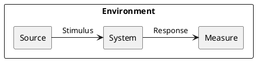

*Stimulus*: condition affecting the system

*Source*: entity generating the stimulus

*Environment*: context under which stimulus occurred (e.g., build, test, deployment, startup, normal operation, overload, failure, attack, change)

*Response*: observable result of the stimulus

*Measure*: benchmark or target value defining a successful response

Pass: 3 scenarios

Good: >3 scenarios

Exceed: >6 scenarios using challenging qualities

}

## Example Scenario

Quality: _Recoverability_

Scenario: In case of power failure, rebooting the system should take up to 20 seconds.

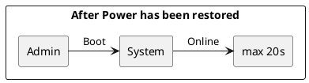

## Scenario 1

Quality: _Freshness_

Scenario: To provide up-to-date information on the website, the data will be crawled at regular intervals between 12h and 48h (to be decided).
 
 ```puml
@startuml

skinparam componentStyle rectangle
skinparam monochrome true
skinparam shadowing false

rectangle "Updating Data" {

rectangle "Automatic Script" as Source
rectangle "Every 12h to 48h" as Measure

Source -> [System] : "Request Update"

[System] -> [Measure] : "Run Crawlers"

}

@enduml
```

## Scenario 2

Quality: _Compatibility_

Scenario: Given that the system will be accessed by users via a web browser, the system should be able to display properly on as many devices and web browsers as possible.

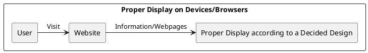

## Scenario 3

Quality: _Scalability_

Scenario: The system should be able to handle an increasing number of users and data without critically hindering performance.

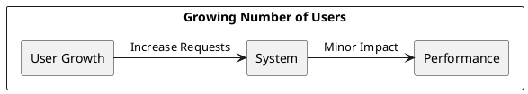

## Scenario 4

Quality: _Simplicity_

Scenario: The user interface should be simple and lightweight to not overwhelm users with too much information at once.

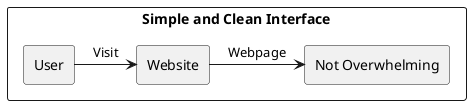

## Scenario 5

Quality: _Learnability_

Scenario: The user interface should resemble familiar and common interfaces to minimize as much as possible the learning curve of the user and allow them to use the website within 2 minutes of their arrival.

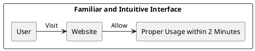

## Scenario 6

Quality: _Privacy_

Scenario: Account creation should be optional and will not require anything other than a username, an email and a password without asking for any sensitive information.

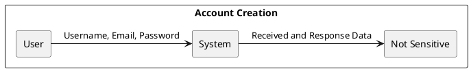

## Scenario 7

Quality: _Feasibility (Affordability)_

Scenario: The system may lack data if crawlers are blocked or if there is no legal permission to crawl a website.

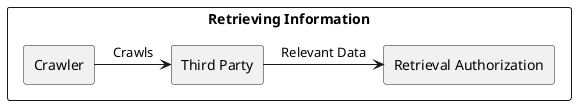


# Ex - Quality Attribute Tradeoff

{.instructions

Pick a free combination of two qualities on the [map](https://usi365.sharepoint.com/:x:/s/MSDE-2022-SoftwareArchitecture/ESVksoXVgMNHtKBKrIwatMYBqorOFaKjxnoqssEy0gNPCg?e=81W7SI) and write your name to claim it.

Then write a short text giving an example for the tradeoff in this assignment.

Pass: 1 unique trade-off

Good: 2 trade-offs

Exceed: >2 trade-offs

}

## Portability vs. Performance (Example)

Developing an app natively for each OS is expensive and time consuming, but it benefits from a good performance. Choosing a cross-platform environment on the other hand simplify the development process, making it faster and cheaper, but it might suffer in performance.

## Availability vs. Feasibility

Crawling any possible website for data would increase the availability of information on the domain but would imply getting blocked or even breaking the law. Crawling only websites that gave permission to do so would allow the domain to exist without any violations but would reduce the available data over the website.

## Privacy vs. Customizability

If the website were to provide a recommender system to users to suggest products to users, it would benefit from asking for data such as age or gender of the user to improve the recommendations but it would imply that we would possibly store sensitive data regarding the user. On the other hand, to the benefit of privacy we could not store any data that to be fed to a recommender system and, therefore, its accuracy may initially suffer.

## Availability as Freshness vs Durability

Bringing fresh data to the users would imply a frequent refresh of the entirety of the data that we store meaning that, while we would use a persisent storage to achieve it, we do not care about keeping old products but only about the most recent and available ones and we would lose long term durability of the data. Storing permanently all the data that we frequently refresh would allow for an immense database but it would not benefit the service whatsoever as we would not use the old data in any way. Additionally, we could argue that keeping so much data could hinder the capacity of the system as the data will grow very quickly.

# Ex - Feature Modeling

{.instructions

In the context of your chosen project domain, describe your domain using a feature model.

The feature model should be correctly visualized using the following template:


If possible, make use of all modeling constructs.

Pass: Include at least 4 non-trivial features

Good: Include at least 6 non-trivial features, which are all implemented by your project

Exceed: Include more than 8 non-trivial features, indicate which are found in your project and which belong to one competitor

}


# Ex - Context Diagram

{.instructions

Prepare a context diagram to define the design boundary for your project.

Here is a PlantUML/C4 example to get started.


Make sure to include all possible user personas and external dependencies you may need.

Pass: 1 User and 1 Dependency

Good: >1 User and >1 Dependency

Exceed: >1 User and >1 Dependency, with both incoming and outgoing dependencies

}


# Ex - Component Model: Top-Down

{.instructions

Within the context of your project domain, represent a model of your modular software architecture decomposed into components.

The number of components in your logical view should be between 6 and 9:

- At least one component should be further decomposed into sub components
- At least one component should already exist. You should plan how to reuse it, by locating it in some software repository and including in your model the exact link to its specification and its price.
- At least one component should be stateful.

The logical view should represent provide/require dependencies that are consistent with the interactions represented in the process view.

The process view should illustrate how the proposed decomposition is used to satisfy the main use case given by your domain model.

You can add additional process views showing how other use cases can be satisfied by the same set of components.

This assignment will focus on modularity-related decisions, we will worry about deployment and the container view later.

Here is a PlantUML example logical view and process view.

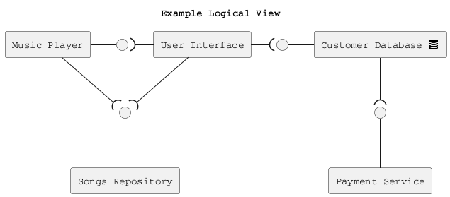

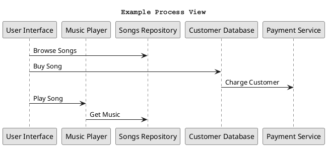

Hint: How to connect sub-components to other external components? Use this pattern.

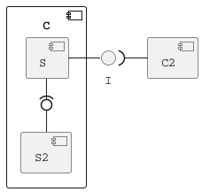

Pass: 6 components (1 decomposed), 1 use case/process view

Good: 6 components (1 decomposed), 2 use case/process view

Exceed: >6 components (>1 decomposed) and >2 use case/process view

}

## Logical View

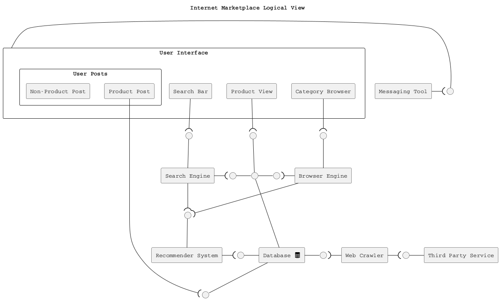

## Process Views

### User Search and Browse

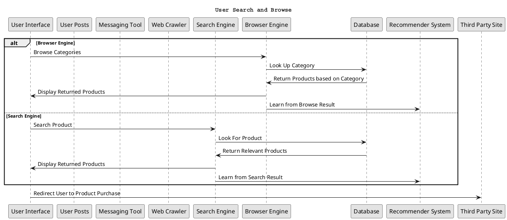

### User Post or Crawled Data

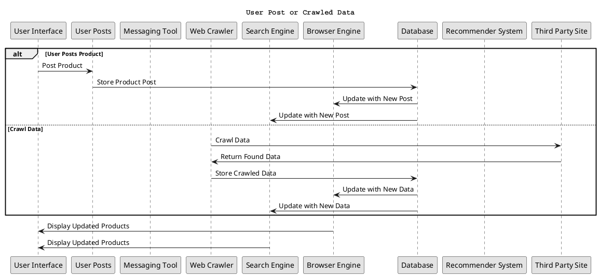

### Contact Other Users

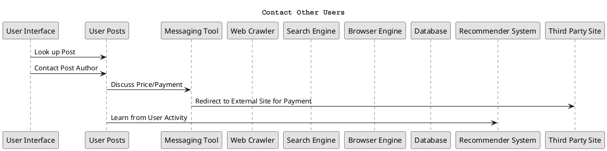


# Ex - Component Model: Bottom-Up

{.instructions

Within the context of your project domain, represent a model of your modular software architecture decomposed into components.

To design this model you should attempt to buy and reuse as many components as possible.

In addition to the logical and process views, you should give a precise list to all sources and prices of the components you have selected to be reused.

Write an ADR to document your component selection process (indicating which alternatives were considered).

Pass: Existing design with at least 1 reused components (1 Logical View, 1 Process View)

Good: Existing design with at least 3 reused components (1 Logical View, 1 Process View, 1 ADR)

Exceed: Redesign based on >3 reused components (1 Logical View, >1 Process View, >1 ADR)

}

## Logical View

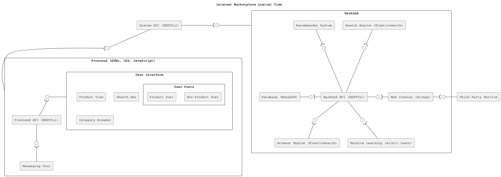

## Process Views

### User Search and Browse

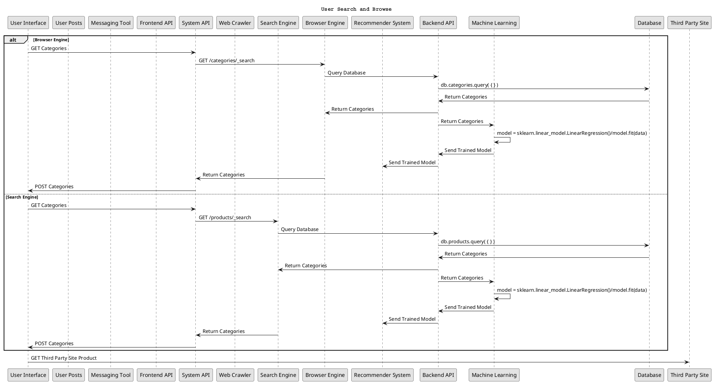

### User Post or Crawled Data

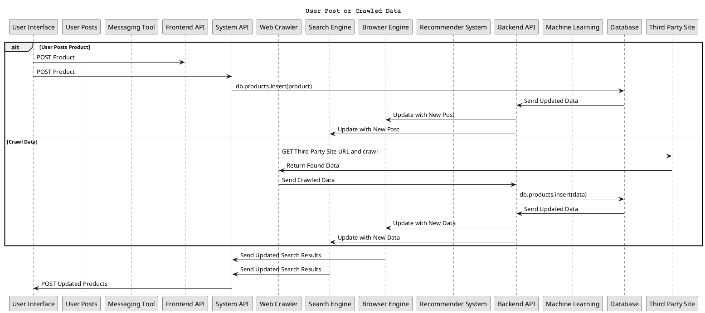

### Contact Other Users

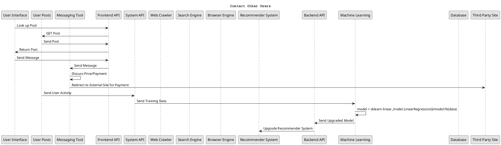

## ADR #1: Crawling Technology

For this architectural decision record, please refer to [the record described here](#adr-2-crawling-technology).

## ADR #2: Training Technology
Decision Made

  - The framework to be used to train the recommender system model will be scikit-learn with pandas and NumPy

Context of the Decision

  - The context of this decision involves training a proper recommender system such that users will find useful suggestions related to them when visiting our website.
  
  - The objective is to allow for the training of a model that will suggest products to users reliably and efficiently

  - This decision will not affect much of the architecture, only a subset of the backend will be impacted by this choice.

Solved Problem

  - How do we provide a reliable recommender system?

Alternatives Considered

  - scikit-learn
  - TensorFlow
  - SciPy

Choice Made

  - scikit-learn

Reason for the Choice

The reason behind the choice is mostly due to personal familiarity with the framework as it has been used and covered in university courses. In addition pandas and NumPy will be used as auxiliary tools to manipulate the data to then be used by the model to train itself.

## ADR #3: Database Technology

Decision Made

- The Database technology will be MongoDB

Context of the Decision

- The context involves storing data that can vary in the information it provides and standardize it to a single format.

- This decision will affect the backend as the database provides information to all the other backend services which will then provide it to the frontend.

Solved Problem

- How can we store the data of products properly?

Alternatives Considered

- MongoDB
- MySQL
- Cassandra
- Neo4j

Choice Made

- MongoDB

Reason for the Choice

The reason behind choosing MongoDB is that, given that products can vary from site to site with possibly missing (or redundant) information and are mostly described in plain text, a documental database would be the best option to store it.

## ADR #4: Search Technology

For this architectural decision record, please refer to [the record described here](#adr-3-search-technology).


# Ex - Interface/API Specification

{.instructions

In this iteration, we will detail your previous model to specify the provided interface of all components based on their interactions found in your existing process views.

1. choose whether to use the top down or bottom up model. If you specify the interfaces of the bottom up model, your interface descriptions should match what the components you reuse already offer.

2. decide which interface elements are operations, properties, or events.

Get started with one of these PlantUML templates, or you can come up with your own notation to describe the interfaces, as long as it includes all the necessary details.

The first template describes separately the provided/required interfaces of each component. 


The second template annotates the logical view with the interface descriptions: less redundant, but needs the logical dependencies to be modeled to show which are the required interfaces.


Pass: define interfaces of all outer-level components

Good: Define interfaces of all outer-level components. Does your architecture publish a Web API? If not, extend it so that it does. 

Exceed: Also, document the Web API using the OpenAPI language. You can use the [OpenAPI-to-Tree](http://api-ace.inf.usi.ch/openapi-to-tree/) tool to visualize the structure of your OpenAPI description.

}

In order to design the interface, the top-down model was used.

### Interface Specification


### Open API Tree

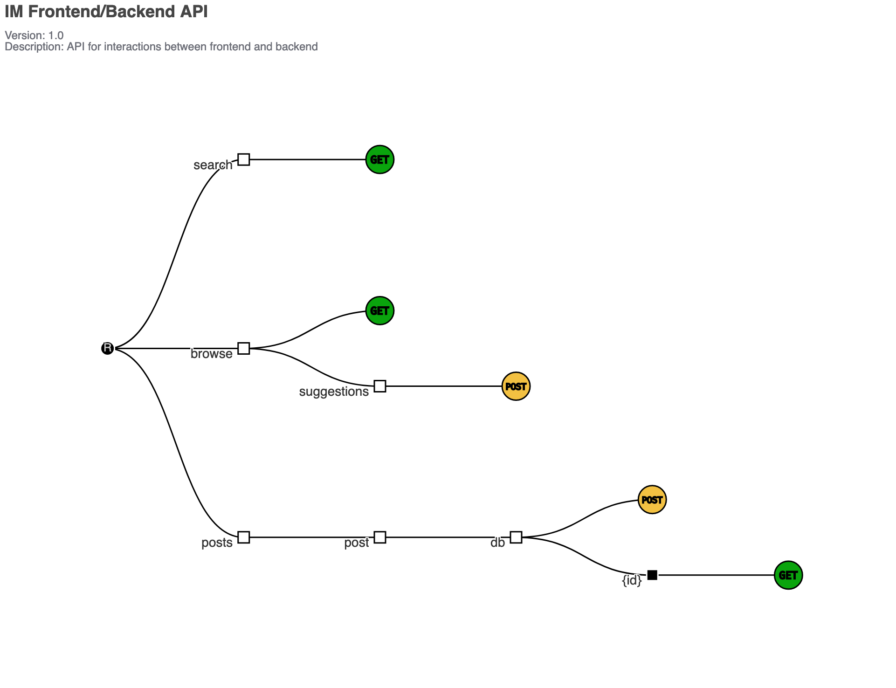

# Ex - Connector View

{.instructions

Extend your existing models introducing the connector view

For every pair of connected components (logical view), pick the most suitable connector. Existing components can play the role of connector, or new connectors may need to be introduced.

Make sure that the interactions shown in the process views reflect the primitives of the selected connector


Pass: model existing connectors based on previous model decisions

Good: model existing connectors based on previous model decisions, write an ADR about the choice of one connector

Exceed: introduce a new type of connector and update your existing process view 
(sequence diagram) to show the connector primitives in action

}


## Architectural Decision Record

### Decision Made

- The frontend and the backend will interact via a connector modeled as a Web API.

### Context of the Decision

 - The context of the decision stems from the fact that the various components of the system will have to interact with each other and we need to find a viable option to make that happen.

- Given the requirements, the choice will impact the architecture on a large scale but it won't impact the smaller components themselves, only the way that they interact with each other.

### Solved Problem

- How can the components communicate with each other?

###  Alternatives Considered

- Web API
- RPC

### Choice Made

- Web API

### Reason for the Choice

- The choice of the Web API seems like the better one as it allows for a standard way of communication between the various components of the system. Having ad hoc sets of instructions to send information between all the components would introduce a level of complexity that is just unnecessary.

# Ex - Adapters and Coupling

{.instructions

1. Highlight the connectors (or components) in your existing bottom-up design playing the role of adapter. (We suggest to use the bottom-up design since when dealing with externally sourced components, their interfaces can be a source of mismatches).
2. Which kind of mismatch** are they solving?
3. Introduce a wrapper in your architecture to hide one of the previously highlighted adapters
4. Where would standard interfaces play a role in your architecture? Which standards could be relevant in your domain?
5. Explain how one or more pairs of components are coupled according to different coupling facets
6. Provide more details on how each adapter solves the mismatches identified using pseudo-code or the actual code
7. How can you improve your architectural model to minimize coupling between components? (Include a revised logical/connector view with your solution)

Pass: 1-5 (with one adapter)

Good: 1-6 (with at least two adapters)

Exceed: 1-7 (with at least two adapters)

** If you do not find any mismatch in your existing design we suggest to introduce one artificially.

## Hints

* (1) Should we find cases where two components cannot communicate (and are doing it wrongly) and highlight they would need an adapter?, or cases where we have already a "component playing the role of adapter in the view" and highlight only the adapter?

  *Both are fine. We assumed that if you draw a dependency (or a connector) the interfaces match, but if you detect that the components that should communicate cannot communicate then of course introduce an adapter to solve the mismatch*

* (2) Please show the details about the two interfaces which do not match (e.g., names of parameters, object structures) so that it becomes clear why an adapter is needed and what the adapter should do to bridge the mismatch

* (5-6) These questions are about the implications on coupling based on the decisions you documented in the connector view.
Whenever you have a connector you couple together the components and different connectors will have different forms of coupling

  For example, if you use calls everywhere, do you really need them everywhere? is there some pair of components where you could use a message queue instead?

  Regarding the coupling facets mentioned in question 5. You do not have to answer all questions related to "discovery", "session", "binding", "interaction", "timing", "interface" and "platform" (p.441, Coupling Facets). Just the ones that you think are relevant for your design and by answering them you can get ideas on how to do question 6.

}

## Identified Adapters

The adapters that we identify in the main architecture are: the Web API that allows for communication between frontend and backend and the possible existing Web APIs that we could interact with when crawling or requesting data from a website.

We highlight them in green as follows:

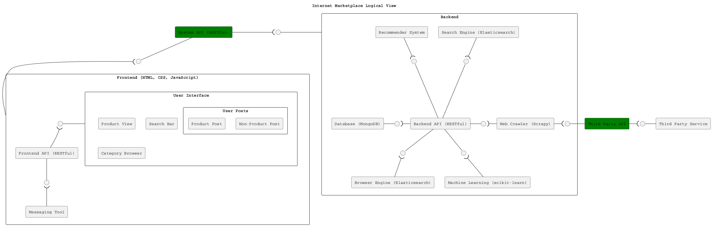
```
Is the scrapy component able to interact with third party APIs?
```
## Solved Mismatches

The mismatches solved by both APIs are similar in nature. The frontend/backend API takes care of forwarding HTTP requests back and forth in order to allow for local execution of instructions while, in case a website provides an API for crawling or for requesting data, that would solve the mismatch of having to crawl manually through CSS selectors and would simplify the process via forwarding of HTTP requests.

## Introduced Wrappers

```puml
@startuml
skinparam componentStyle rectangle

!include <tupadr3/font-awesome/database>

title Internet Marketplace Logical View

component FE as "Frontend (HTML, CSS, JavaScript)" {
  component FRAPI as "Frontend API (RESTful)"
  component UI as "User Interface" {
    component PV as "Product View"
    component SB as "Search Bar"
    component CB as "Category Browser"
    component "User Posts" as UP {
      component "Non-Product Post" as NPP 
      component "Product Post" as PP
    }
  }
  [Messaging Tool] as MT
  interface " " as MTI
  interface " " as UII
}

component "Backend Wrapper" {
  [System API (RESTful)] as API
  interface " " as BEI

  component BE as "Backend" {
    component BAPI as "Backend API (RESTful)"
    component DB as "Database (MongoDB)"
    interface " " as WCI
    interface " " as DBI
    interface " " as SEI
    interface " " as BREI
    interface " " as RSI
    component SE as "Search Engine (Elasticsearch)"
    component RS as "Recommender System"
    component BRE as "Browser Engine (Elasticsearch)"
    component WC as "Web Crawler (Scrapy)"
    interface " " as TPSI
    [Machine Learning (scikit-learn)] as ML
    interface " " as MLI
  }
}

component "Crawl Wrapper" {

  [Third Party Service] as TPS

  [Third Party API] as TAPI
  interface " " as TAPII

}

interface " " as FEI
API -- FEI
FEI )-- FE

API -( BEI
BEI - BE

FRAPI -- MTI
MTI )-- MT

UI - UII
UII )-- FRAPI

WC -( TPSI
TPSI -- TAPI

BAPI - WCI
WCI )- WC

DB - DBI
DBI )- BAPI

SE --( SEI
SEI -- BAPI

BAPI -- BREI
BREI )-- BRE

RS --( RSI
RSI -- BAPI

BAPI -- MLI
MLI )-- ML

TAPI -( TAPII
TAPII - TPS

skinparam shadowing false
skinparam defaultFontName Courier
@enduml
```

```
Is the crawl wrapper able to send HTML output to the scrapy component?
```
## Standard Interfaces

Given the two adapters that we identified, we can say that the main web API that allows communication between frontend and backend is not a standard as it is an _ad hoc_ interface that we have made for our system. The potentially existing API(s) that connect to other websites would instead be a standard as, by utilizing them and connecting to them, we would be making them a _de facto_ standard. Additionally, they could already be a widely used interface and a standard.
```
Can frontend and backend exchange information using standards such as JSON or XML?
```
## Coupling Facets

We examine the frontend component with coupling facets as follows:

- The frontend is actually not aware of the components it talks to, it sends requests to the API that then takes care of connecting to the backend to return what is needed. Therefore, discovery is automatic.
  
- The frontend shares a session with the API and, while code may execute asynchronously with other sessions, the client and the API are required to be up and running at the same time.

- The API should be able to whitstand change as it is a flexible RESTful API. Removing features would be something hard to take into account but that inherently depends on the fact that feature removal is harder than adding new ones.

- Interactions between frontend and backend are completely indirect as they must go through the main API first.

- The API selects the component at design-time as it is designed to select components for the frontend to talk to. Therefore, we have early-binding.

- The platform should not have any impact on the frontend or the API as the frontend is a web-based component and the API is not platform dependant as it works over HTTP.

## Pseudo-Code

### Web API Adapter

```
  Post getPostById(id) {
    Post p = query db for post with id
    return p
  }

  void storePost(post) {
    uuid = generate new unique identifier
    store post into db
  }

  Products[] search(keywords) {
    match keywords and return products through elasticsearch
  }

  Products[] search(categories) {
    match categories and filter products through elastic
  }

  void postModel(model) {
    send model to recommender system
  }
```

### Third Party Website API

Please, not that these APIs may not exist for all websites, they are hypothetically described with features that we would use if available.

```
  Document getDocumentById(id) {
    return document with id
  }

  Document[] getDocumentsByCategory(categoryId) {
    return documents that match the category via the API if it exists
  }

  Document[] getDocumentsByKeywords(keywords) {
    return documents that match the given keywords
  }

```

# Ex - Physical and Deployment Views

{.instructions

a. Extend your architectural model with the following viewpoints:

1. Physical or Container View

2. Deployment View

Your model should be non-trivial: include more than one physical device/virtual container (or both). Be ready to discuss which connectors are found at the device/container boundaries.

b. Write an ADR about which deployment strategy you plan to adopt. The alternatives to be considered are: big bang, blue/green, shadow, pilot, gradual phase-in, canary, A/B testing.

c. (Optional) Prepare a demo of a basic continuous integration and delivery pipeline for your architectural documentation so that you can obtain a single, integrated PDF with all the viewpoints you have modeled so far. 

For example:

- configure a GitHub webhook to be called whenever you push changes to your documentation
- setup a GitHub action (or similar) to build and publish your documentation on a website

Pass: 1 physical view, 1 deployment view, 1 ADR (b.)

Good: >1 physical view, >1 deployment view, 1 ADR (b.)

Exceed: 1 physical view, 1 deployment view, 1 ADR (b.) + 1 demo (c.)

}

## Container View


## Deployment View


{.feedback

A deployment view should describe where each logical component is going to be deployed. This view looks more like a Physical View as it does not appear to contain any logical component.

}

## ADR: Deployment Strategy
Decision Made

  - The frontend part of the system will be deployed based on A/B Testing while the backend will be deployed using a Blue/Green strategy.

Context of the Decision

  - The context of the decision involves maximizing the availability of the system without sacrificing performance.

Solved Problem

  - How can we allow deployment without destroying everything?

Alternatives Considered

  - Big Bang
  - Blue/Green
  - Shadow
  - Pilot
  - Gradual Phase-in
  - Canary
  - A/B Testing

Choices Made

  - A/B Testing (Frontend)
  - Blue/Green (Backend)

Reason for the Choice

We choose A/B Testing for the frontend as, really, the UI will be affected by this type of deployment. This is already employed by many large companies such as YouTube. Sometimes you may notice something slightly different on your web interface and the next time you use the site it is gone or replaced by something else. Therefore, releasing small changes to the UI to different small subsets of users and seeing the reactions looks like a great option to keep the interface up to date.

Instead, we choose Blue/Green for the backend as we want to deploy our changes to actual meaningful features that will impact performance and availability and we want to be able to revert to a stable version in case the newer one unexpectedly fails or crashes.

# Ex - Availability and Services

{.instructions 

The goal of this week is to plan how to deliver your software as a service with high availability.

1. If necessary, change your deployment design so that your software is hosted on a server (which could be running as a Cloud VM). Your SaaS architecture should show how your SaaS can be remotely accessed from a client such as a Web browser, or a mobile app
2. Sketch your software as a service pricing model (optional)
3. How would you define the availability requirements in your project domain? For example, what would be your expectation for the duration of planned/unplanned downtimes or the longest response time tolerated by your clients?
4. Which strategy do you adopt to monitor your service's availability? Extend your architecture with a watchdog or a heartbeat monitor and motivate your choice with an ADR.
5. What happens when a stateless component goes down? model a sequence diagram to show what needs to happen to recover one of your critical stateless components
6. How do you plan to recover stateful components? write an ADR about your choice of replication strategy and whether you prefer consistency vs. availability. Also, consider whether event sourcing would help in your context.
7. How do you plan to avoid cascading failures? Be ready to discuss how the connectors (modeled in your connector view) impact the reliability of your architecture.
8. How did you mitigate the impact of your external dependencies being not available? (if applicable)

Pass: 1, 3, 4, one of:  5, 6, 7, 8

Good: 1, 2, 3, 4, two of:  5, 6, 7, 8

Exceed: 1, 2, 3, 4, 5, 6, 7, 8

}

### 1. Server Hosting

The software would already run on a server.

### 2. Service Pricing Model

The software would be free, the purpose of this application is not to sell services. The website aims to survive via donations and advertisements.

### 3. Availability Requirements

Given the free nature of the project, we do not expect to guarantee extremely high availability standards but we also do not aim to do the bare minimum. Regarding planned downtimes, we expect the service to not be down for long. In order to warn users about expected downtimes, we could add model a `div` signaling an expected downtime for maintenance that would last from 15 to 30 minutes on a specific date.

As for unplanned downtimes, they would certainly prove damaging to us as we rely on users to view advertisements or donate meaning that, if our services are down, we cannot have any users. The duration of such downtimes is not predictable but we hope to minimize it.

The expected response time should be within 500ms and 3s. Any user would be loading up a webpage, our service should be responsive by using Elasticsearch for search functionalities and by having a lightweight UI but, taking latency into account, a couple of seconds is to be expected and I believe it to be a common thing across the web for websites to take a moment to load so it should not impact the experience of a user too drastically.

### 4. Availability Monitoring

#### Logical View

```puml
@startuml
skinparam componentStyle rectangle

!include <tupadr3/font-awesome/database>

title Internet Marketplace Logical View

component WD as "Watchdog"
interface " " as WDI

component FE as "Frontend (HTML, CSS, JavaScript)" {
  component FRAPI as "Frontend API (RESTful)"
  component UI as "User Interface" {
    component PV as "Product View"
    component SB as "Search Bar"
    component CB as "Category Browser"
    component "User Posts" as UP {
      component "Non-Product Post" as NPP 
      component "Product Post" as PP
    }
  }
  [Messaging Tool] as MT
  interface " " as MTI
  interface " " as UII
}

[System API (RESTful)] as API

component BE as "Backend" {
  component BAPI as "Backend API (RESTful)"
  component DB as "Database (MongoDB)"
  interface " " as WCI
  interface " " as DBI
  interface " " as SEI
  interface " " as BREI
  interface " " as RSI
  component SE as "Search Engine (Elasticsearch)"
  component RS as "Recommender System"
  component BRE as "Browser Engine (Elasticsearch)"
  component WC as "Web Crawler (Scrapy)"
  interface " " as TPSI
  [Machine Learning (scikit-learn)] as ML
  interface " " as MLI
}

[Third Party Service] as TPS

interface " " as FEI
API -- FEI
FEI )-- FE

interface " " as BEI
API -( BEI
BEI - BE

FRAPI -- MTI
MTI )-- MT

UI - UII
UII )-- FRAPI

WC -( TPSI
TPSI - TPS

BAPI - WCI
WCI )- WC

DB - DBI
DBI )- BAPI

SE --( SEI
SEI -- BAPI

BAPI -- BREI
BREI )-- BRE

RS --( RSI
RSI -- BAPI

BAPI -- MLI
MLI )-- ML

WD -( WDI
WDI - API

skinparam shadowing false
skinparam defaultFontName Courier
@enduml
```

#### ADR: Availability Monitoring Strategy
Decision Made

  - The availability of the system will be monitored via a watchdog.

Context of the Decision

  - We need to have a way to monitor the availability of the system.

Solved Problem

  - How can we monitor the system without overloading it?

Alternatives Considered

  - Watchdog
  - Heartbeat

Choices Made

  - Watchdog

Reason for the Choice

  - We choose a watchdog as it is the simplest way to check for availability and it would only add up as just another periodic request. Given that our system should handle a large amount of requests, one more request from the watchdog should not add any significant overhead and will be simpler than a heartbeat approach.

### 7. Cascading Failures

 In our architecture, not all components would cause cascading failures ending up with the entire system down. In particular, the database and the API are the components that could cause the entire system to crash.

 If the database were to stop working for any reason, there would be no way of getting data to display to users and, therefore, the system would stop being available while, if the API were to go down, the same issue would present itself but under another aspect. The frontend would not able to talk to the backend anymore and we would not be able to get data rendering the system unable to provide users with what they need.

 One could make an argument that if the engines were to crash, then users would not be able to narrow their search for what they look for but, regardless of that, the entire data could still be requested without providing any filters. As expensive as it is, it could be a last resort to avoid crashing in case of both engines failing at the same time.

 The other components such as the crawler, the third party sites, the recommender system and the messaging tool should not compromise the entire system. They may render some of the features unavailable for a period of time but they will not cause the entire application to fail as they take care of keeping the data fresh, posting an additional way of finding products and a way to contact other registered users.

 A way to avoid cascading failures would be to replicate the core components onto other backup machines that would handle the requests should the main system fail. Unfortunately, if the main components were to crash on even the backup machines, then failure cannot really be avoided.

### 8. External Dependency Availability

Our main external dependency depends on the third party sites that we would have to crawl. Naturally, if their system were to be down for any reason when we crawl them, we would lose data for that crawling instance which, as stated in the previous iterations of this assignment, will not happen again for another 24 to 48 hours or possibly more depending on what the third party allows us.

In order to mitigate this, we could make an accord with the external company owning the site to allow for "extraordinary" crawling in case of downtime or we could rely on the most recent crawled data which, sometimes, may not fully reflect real product availability.

# Ex - Scalability

{.instructions 

Now that your architecture delivers your software as a service, let's redesign it so that it can scale!

1. Pick one scalability dimension: number of clients, size of input, size of state, number of dependencies

2. How well does your architecture scale along the chosen dimension? Where do you expect the bottleneck to be?

3. Modify your architecture to remove the scalability bottleneck you have identified (show both logical, process and deployment view) - consider whether the API/interface of the bottleneck component should be improved.

4. Write an ADR regarding the scalability pattern you have introduced.

5. Write an ADR regarding the issue of component discovery, choosing one of the alternatives: dependency injection vs. directory. Can you identify an existing component playing the role of directory/dependency injection container? Could you give an example of where you would need to add such component to facilitate dynamic component discovery?

Pass: 1, 2, 3, 5

Good: 1, 2, 3, 4, 5

Exceed: 1, 2, 3, 4, 5 then redo 1, 2, 3 for different scalability dimensions

}

## 1. Scalability Dimension

The scalability dimension that we choose is the number of clients. This is probably the most relevant dimension that concerns our project. Given that the project will be a website that aims to handle a large number of requests from many users, this is the dimension that we expect to deal with the most.

## 2. Bottleneck

The whole frontend including the API should be lightweight and Elasticsearch was chosen precisely because it supports text search over large quantities of data. We expect the bottleneck to be in the fact that the database is currently running on a single machine meaning that there is a chance that a growing number of requests may overload such machine.

## 3. Updated Views

### Logical View

```puml
@startuml
skinparam componentStyle rectangle

!include <tupadr3/font-awesome/database>

title Internet Marketplace Logical View


component FE as "Frontend (HTML, CSS, JavaScript)" {
  component FRAPI as "Frontend API (RESTful)"
  component UI as "User Interface" {
    component PV as "Product View"
    component SB as "Search Bar"
    component CB as "Category Browser"
    component "User Posts" as UP {
      component "Non-Product Post" as NPP 
      component "Product Post" as PP
    }
  }
  [Messaging Tool] as MT
  interface " " as MTI
  interface " " as UII
}

[System API (RESTful)] as API
interface " " as LBI
[Request Load Balancer] as LB
 
component BE as "Backend" {
  component BAPI as "Backend API (RESTful)"
  component DB as "Database Over Multiple Machines (MongoDB)"
  interface " " as WCI
  interface " " as DBI
  interface " " as SEI
  interface " " as BREI
  interface " " as RSI
  component SE as "Search Engine (Elasticsearch)"
  component RS as "Recommender System"
  component BRE as "Browser Engine (Elasticsearch)"
  component WC as "Web Crawler (Scrapy)"
  interface " " as TPSI
  [Machine Learning (scikit-learn)] as ML
  interface " " as MLI
}

[Third Party Service] as TPS

interface " " as FEI
API -- FEI
FEI )-- FE

interface " " as BEI
API -( LBI
LBI - LB
LB -( BEI
BEI - BE

FRAPI -- MTI
MTI )-- MT

UI - UII
UII )-- FRAPI

WC -( TPSI
TPSI - TPS

BAPI - WCI
WCI )- WC

DB - DBI
DBI )- BAPI

SE --( SEI
SEI -- BAPI

BAPI -- BREI
BREI )-- BRE

RS --( RSI
RSI -- BAPI

BAPI -- MLI
MLI )-- ML

skinparam shadowing false
skinparam defaultFontName Courier
@enduml
```

### Process View

```puml
@startuml
title User Search and Browse

participant "User Interface" as UI
participant "User Posts" as UP
participant "Messaging Tool" as MT
participant "Frontend API" as FRAPI

participant "System API" as API
participant "Load Balancer" as LB
participant "Worker A" as WA
participant "Worker B" as WB

participant "Web Crawler" as WC
participant "Search Engine" as SE
participant "Browser Engine" as BE
participant "Recommender System" as RS
participant "Backend API" as BAPI
participant "Machine Learning" as ML
participant "Databases" as DB

participant "Third Party Site" as TPS

alt Browser Engine
UI -> API: GET Categories
API -> LB: Assign to Worker A
LB -> WA
WA -> BE: GET /categories/_search
BE -> BAPI: Query a Database
BAPI -> DB: db.categories.query( { } )
DB -> BAPI: Return Categories
BAPI -> BE: Return Categories
BAPI -> ML: Return Categories
ML -> ML: model = sklearn.linear_model.LinearRegression()/model.fit(data)
ML -> BAPI: Send Trained Model
BAPI -> RS: Send Trained Model
BE -> WA: Return Categories
WA -> LB: Return Categories
LB -> API: Return Categories
API -> UI: POST Categories

else Search Engine
UI -> API: GET Categories
API -> LB: Assign to Worker B
LB -> WB
WB -> SE: GET /products/_search
SE -> BAPI: Query a Database
BAPI -> DB: db.products.query( { } )
DB -> BAPI: Return Categories
BAPI -> SE: Return Categories
BAPI -> ML: Return Categories
ML -> ML: model = sklearn.linear_model.LinearRegression()/model.fit(data)
ML -> BAPI: Send Trained Model
BAPI -> RS: Send Trained Model
SE -> WB: Return Categories
WB -> LB: Return Categories
LB -> API: Return Categories
API -> UI: POST Categories
end

UI -> TPS: GET Third Party Site Product

skinparam monochrome true
skinparam shadowing false
skinparam defaultFontName Courier
@enduml
```

### Deployment View


## 4. ADR: Scalability Pattern

Decision Made

  - The scalability pattern introduced will be a load balancer.

Context of the Decision

  - The context is that we need to apply a pattern in order to guarantee scalability with the number of requests received.

Solved Problem

  - How can we scale up in terms of number of clients?

Alternatives Considered

  - Load Balancing
  - Master/Worker
  - Sharding

Choice Made

  - Load Balancing

Reason for the Choice

  - Among the considered patterns, load balancing is the only one that truly addresses the issue of a growing amount of clients. Master/Worker and sharding would probably not be as useful to face the problem as they  allow us to work with larger data in different ways. The former works best when handling a large chunk of data while the latter increases storage capacity. Unfortunately, we do not plan on increasing our capacity largely as we refresh the data that we acquire from partnered sites throwing away older entries and requests will never be more complicated than a few keywords or categories so we will not need to compute large amounts of data. Therefore, a load balancer is the perfect fit for our issue.

## 5. ADR: Component Discovery

Decision Made

  - The way to discover components will be via a Directory.

Context of the Decision

  - The context is that we need to finda a way to allow dynamic component discovery.

Solved Problem

  - How do we allow component discovery?

Alternatives Considered

  - Directory
  - Dependency Injection

Choice Made

  - Directory

Reason for the Choice

  - Given our choice of a load balancer in order to handle growing requests, we need to implement a Directory to support it. The load balancer requires to assign work to available workers and the Directory can allow that since it holds interface endpoints via a description. We can have the endpoints of available workers registered on the Directory that will then allow the other components to find the workers to assign the work to.

# Ex - Flexibility

{.instructions 

Only dead software stops changing. You just received a message from your customer, they have an idea. Is your architecture ready for it?

1. Pick a new use case scenario. Precisely, what exactly do you need to change of your existing architecture so that it can be supported? Model the updated logical/process/deployment views.

2. Pick another use case scenario so that it can be supported without any major architectural change (i.e., while you cannot add new components, it is possible to extend the interface of existing ones or introduce new dependencies). Illustrate with a process view, how your previous design can satisfy the new requirement.

3. Change impact. One of your externally sourced component/Web service API has announced it will introduce a breaking change. What is the impact of such change? How can you control and limit the impact of such change? Update your logical view

4. Open up your architecture so that it can be extended with plugins by its end-users. Where would be a good extension point? Update your logical view and give at least one example of what a plugin would actually do.

5. Assuming you have a centralized deployment with all stateful components storing their state in the same database, propose a strategy to split the monolith into at least two different microservices. Model the new logical/deployment view as well as the interfaces of each microservice you introduce.

Pass: 1, one out of 2-5.

Good: 1, two out of 2-5.

Exceed: 1-5.

}

## 1. New Use Case Scenario

The new scenario consists in adding a machine that would hold a data lake within our system with the purpose of data analytics. Instead of throwing away older entries in favour of new ones, we keep all the products that we crawl and we run statistical analyses such as the most popular category of product or the average price for a certain producer over time, for instance.

### Logical View

```puml
@startuml
skinparam componentStyle rectangle

!include <tupadr3/font-awesome/database>

title Internet Marketplace Logical View


component FE as "Frontend (HTML, CSS, JavaScript)" {
  component FRAPI as "Frontend API (RESTful)"
  component UI as "User Interface" {
    component PV as "Product View"
    component SB as "Search Bar"
    component CB as "Category Browser"
    component "User Posts" as UP {
      component "Non-Product Post" as NPP 
      component "Product Post" as PP
    }
  }
  [Messaging Tool] as MT
  interface " " as MTI
  interface " " as UII
}

[System API (RESTful)] as API

component BE as "Backend" {
  component BAPI as "Backend API (RESTful)"
  component DB as "Database (MongoDB)"
  interface " " as WCI
  interface " " as DBI
  interface " " as SEI
  interface " " as BREI
  interface " " as RSI
  component SE as "Search Engine (Elasticsearch)"
  component RS as "Recommender System"
  component BRE as "Browser Engine (Elasticsearch)"
  component WC as "Web Crawler (Scrapy)"
  interface " " as TPSI
  [Machine Learning (scikit-learn)] as ML
  interface " " as MLI
  interface " " as DLI
  component DL as "Data Lake"
}

[Third Party Service] as TPS

interface " " as FEI
API -- FEI
FEI )-- FE

interface " " as BEI
API -( BEI
BEI - BE

FRAPI -- MTI
MTI )-- MT

UI - UII
UII )-- FRAPI

WC -( TPSI
TPSI - TPS

BAPI - WCI
WCI )- WC

DB - DBI
DBI )- BAPI

SE --( SEI
SEI -- BAPI

BAPI -- BREI
BREI )-- BRE

RS --( RSI
RSI -- BAPI

BAPI -- MLI
MLI )-- ML

DL -- DLI
DLI )-- BAPI

skinparam shadowing false
skinparam defaultFontName Courier
@enduml
```

### Process View

```puml
@startuml
title User Post or Crawled Data

participant "User Interface" as UI
participant "User Posts" as UP
participant "Messaging Tool" as MT
participant "Frontend API" as FRAPI

participant "System API" as API

participant "Web Crawler" as WC
participant "Search Engine" as SE
participant "Browser Engine" as BE
participant "Recommender System" as RS
participant "Backend API" as BAPI
participant "Machine Learning" as ML
participant "Database" as DB
participant "Data Lake" as DL

participant "Third Party Site" as TPS

alt User Posts Product
UI -> FRAPI: POST Product
UI -> API: POST Product
API -> DB: db.products.insert(product)
API -> DL: db.products.insert(product)
DB -> BAPI: Send Updated Data
BAPI -> BE: Update with New Post
BAPI -> SE: Update with New Post

else Crawl Data
WC -> TPS: GET Third Party Site URL and crawl
TPS -> WC: Return Found Data
WC -> BAPI: Send Crawled Data
BAPI -> DB: db.products.insert(data)
BAPI -> DL: db.products.insert(data)
DB -> BAPI: Send Updated Data
BAPI -> BE: Update with New Data
BAPI -> SE: Update with New Data
end

BE -> API: Send Updated Search Results
SE -> API: Send Updated Search Results

API -> UI: POST Updated Products


skinparam monochrome true
skinparam shadowing false
skinparam defaultFontName Courier
@enduml
```

### Deployment View


## 2. Low Impact Use Case Scenario

For this scenario, we choose that we want to employ the data lake that we have added in order to improve our recommender system based on the entire history of entries to provide suggestion over, for instance, the type of category or product that has been most successful and selected over the entire user base.

### Process View

```puml
@startuml
title Data Lake for Machine Learning

participant "Recommender System" as RS
participant "Backend API" as BAPI
participant "Machine Learning" as ML
participant "Database" as DB
participant "Data Lake" as DL

participant "Third Party Site" as TPS

RS -> DL: Request Training Data
DL -> RS: Return Data
RS -> ML: Send Requested Data
ML -> ML: model = sklearn.linear_model.LinearRegression()/model.fit(data)
ML -> BAPI: Send Trained Model
BAPI -> RS: Send Trained Model


skinparam monochrome true
skinparam shadowing false
skinparam defaultFontName Courier
@enduml
```

## 3. Change Impact

Our main (and only) external dependency comprises external websites to crawl the data from. These websites will be crawled either via an API when available or via CSS selectors.

The one instance in which we will be affected by a breaking change in such websites is the one where either the API or the CSS of the site is significantly modified.

If the CSS were to change without an available API or, in case an API exists, both the CSS and the API were to change, we would have to rewrite the crawler as there is no other way to get new data other than by evolving alongside the external dependency.
In such case, we hope that the partnered website will warn us in advance to allow us to change the crawlers in time.

If both CSS and API exist and only one of them changes, then we can design the crawlers to be able to use both, using the API as default. If a change to either part happens, we could use an adapter and a wrapper that keep track of the existence and availability of the API and the CSS of the partnered website. Given that the crawler supports both, if one of them were to break, the adapter could guide the crawler to use the other option that is still available.

That way, in this situation, the impact of a breaking change is successfully mitigated and the crawler can be improved to support the new change to the API/CSS while it will still crawl via the CSS/API.

### Logical View

For the logical view, you can refer to the one from exercise 12 where we introduce wrappers. In particular, the wrapper that contains the third party site and the third party API.

```puml
@startuml
skinparam componentStyle rectangle

!include <tupadr3/font-awesome/database>

title Internet Marketplace Logical View

component FE as "Frontend (HTML, CSS, JavaScript)" {
  component FRAPI as "Frontend API (RESTful)"
  component UI as "User Interface" {
    component PV as "Product View"
    component SB as "Search Bar"
    component CB as "Category Browser"
    component "User Posts" as UP {
      component "Non-Product Post" as NPP 
      component "Product Post" as PP
    }
  }
  [Messaging Tool] as MT
  interface " " as MTI
  interface " " as UII
}

[System API (RESTful)] as API
interface " " as BEI

component BE as "Backend" {
  component BAPI as "Backend API (RESTful)"
  component DB as "Database (MongoDB)"
  interface " " as WCI
  interface " " as DBI
  interface " " as SEI
  interface " " as BREI
  interface " " as RSI
  component SE as "Search Engine (Elasticsearch)"
  component RS as "Recommender System"
  component BRE as "Browser Engine (Elasticsearch)"
  component WC as "Web Crawler (Scrapy)"
  interface " " as TPSI
  [Machine Learning (scikit-learn)] as ML
  interface " " as MLI
}

component "Crawl Wrapper" {

  [Third Party Service] as TPS

  [Third Party API] as TAPI
  interface " " as TAPII

}

interface " " as FEI
API -- FEI
FEI )-- FE

API -( BEI
BEI - BE

FRAPI -- MTI
MTI )-- MT

UI - UII
UII )-- FRAPI

WC -( TPSI
TPSI -- TAPI

BAPI - WCI
WCI )- WC

DB - DBI
DBI )- BAPI

SE --( SEI
SEI -- BAPI

BAPI -- BREI
BREI )-- BRE

RS --( RSI
RSI -- BAPI

BAPI -- MLI
MLI )-- ML

TAPI -( TAPII
TAPII - TPS

skinparam shadowing false
skinparam defaultFontName Courier
@enduml
```

And, to this wrapper, we would add some code to support the functionality we described similar to the following pseudocode.

```
class ThirdPartySite {
  private string siteName
  private bool hasApi
  private bool hasCss

  constructor(string siteName, bool hasApi, bool hasCss) {
    this.siteName = siteName
    this.hasApi = hasApi
    this.hasCss = hasCss
  }

  public onApiChange() {
    hasApi = false
  }

  public onCssChange() {
    hasCss = false
  }

  public useApi() {
    hasApi = true
  }

  public useCss() {
    hasCss = true
  }

  public checkAvailability() {
    // prioritize API over anything else if it exists
    if (hasApi) {
      Crawler.crawlWithApi(siteName)
    } else if (hasCss) {
      Crawler.crawlWithCss(siteName)
    } else {
      // signal that crawler needs to be rewritten
    }
  }
}
```